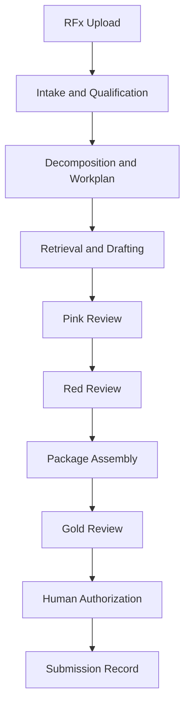
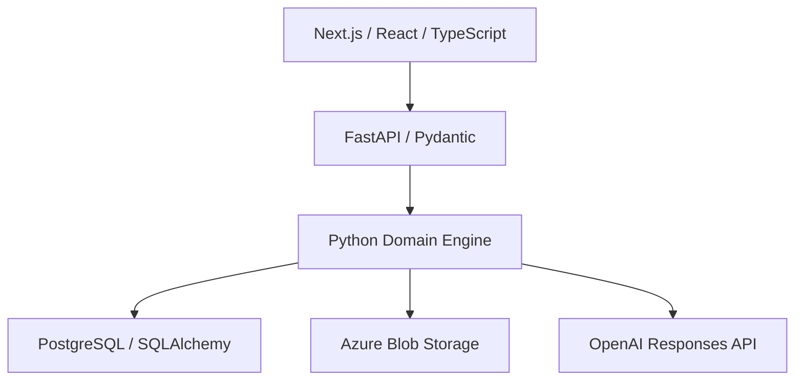

# RFP Engine

**An AI-assisted orchestration platform for managing complex RFx pursuits from intake and qualification through drafting, review, package assembly, and submission readiness.**

RFP Engine combines LLM-based agents with deterministic workflow controls, persistent opportunity state, source-grounded context, human approval gates, artifact lineage, and regression-tested proposal workflows.

> This public repository documents the product, architecture, governance model, and development progress. The active application source remains in a separate private development repository while the project is prepared for a safe public release.

## Latest development milestone — September 21, 2026

Agent 4 drafting now operates against controller-owned requirement identities rather than model-invented local identifiers. In the latest representative replay, the engine preserved a complete 104-requirement traceability set, classified evaluation-only controls separately, routed blocking evidence gaps to the affected response component, and allowed nonblocking gaps to remain visible without overstating coverage.

Recent engineering work includes:

- deterministic projection of drafting results onto authoritative `REQ-*` identifiers;
- complete mapping of 104 requirements in the replay traceability inventory;
- explicit `not_assessed` treatment when the model does not provide defensible coverage;
- component-scoped routing of six blocking requirements to the affected drafting component;
- preservation of two nonblocking evidence gaps for later resolution; and
- regression coverage confirming that non-drafting gaps do not unnecessarily halt unrelated drafting.

The result is a stronger separation between what the model proposes and what the controller accepts: coverage, gaps, and workflow consequences are all tied back to the authoritative requirement inventory.

See the [development log](docs/development-log.md) for dated milestones.

## The problem

Proposal teams do not merely need faster text generation. They need a system that can:

- distinguish solicitation evidence from assumptions;
- stop when required evidence or authority is missing;
- prevent unsupported contractual and technical commitments;
- preserve the exact state and artifacts that were reviewed;
- route discrete decisions to humans without halting unrelated work; and
- bind final approval to the exact package that is submitted.

RFP Engine treats generative AI as one component inside an auditable operational system.

## RFx lifecycle

## Technical architecture

| Layer | Technology | Responsibility |
|---|---|---|
| Web | Next.js, React, TypeScript | Upload, opportunity workspace, review and package controls |
| API | FastAPI, Pydantic | Typed application boundary and multipart intake |
| Domain engine | Python | Workflow execution, validation, gates, reviews, package control |
| Persistence | PostgreSQL, SQLAlchemy, Alembic | Atomic authoritative state and durable read models |
| Artifacts | Azure Blob Storage | Immutable source and generated-artifact storage |
| AI runtime | OpenAI Responses API | Schema-bound analysis and drafting |
| Development | Docker Compose, GitHub Actions | Reproducible services and continuous integration |

## What has been built

- Multi-file PDF, DOCX, XLSX, and TXT solicitation intake
- Normalized source blocks and versioned requirement inventories
- Atomic Opportunity Record revisions with SHA-256 verification
- Restart-safe artifact storage and explicit artifact lineage
- Deterministic controller execution and schema validation
- Structured, model-backed agent invocation
- Human hold-and-resume workflows
- Governed knowledge-approval workspace design for reusable content
- Controller-projected requirement traceability using authoritative requirement IDs
- Component-scoped drafting status and evidence gaps
- Pink and Red review execution with correction loops
- Early package-input inventory with reviewed-value resolution and lineage
- Candidate Package Assembly and deterministic proposal rendering
- Gold review bound to an exact package version
- Explicit final submission authorization
- Immutable submission record and receipt lineage
- PostgreSQL-backed regression testing and CI

## Core design principles

### Human supervises. Engine executes.

The application reduces orchestration burden while preserving explicit human authority over commitments, missing evidence, commercial decisions, and submission.

### Fail closed

Missing evidence, invalid schemas, stale revisions, and package mismatches stop affected operations instead of being silently guessed or repaired.

### Separate probabilistic work from deterministic control

Models analyze and draft. Domain services own workflow transitions, persistence, validation, lineage, and authorization.

### Bind decisions to exact artifacts

Reviews and approvals apply to an identified artifact or package version and checksum. Material change invalidates downstream approval.

## Why the regression tests matter

The historical regression program tests whether the engine behaves safely under realistic proposal pressure—not merely whether it can produce fluent text.

Tested behaviors include:

- stopping when evidence is genuinely missing;
- allowing unaffected drafting components to continue;
- preventing unsupported security, SLA, and commercial commitments;
- persisting authoritative state across restarts;
- detecting incomplete package inputs;
- separating proposal authority from pricing authority;
- requiring re-review when a package changes; and
- preventing submission of anything other than the exact authorized package.

Read the [regression testing story](docs/regression-testing.md) for representative scenarios.

## Documentation

- [Architecture and control boundaries](docs/architecture.md)
- [Development log](docs/development-log.md)
- [Regression testing](docs/regression-testing.md)
- [Portfolio and competency map](docs/portfolio-guide.md)
- [Public data policy](PUBLIC_DATA_POLICY.md)
- [Roadmap](ROADMAP.md)

## Current status

The application has a working full-stack foundation and an implemented controlled lifecycle from upload through submission closeout. The latest acceptance replay demonstrates authoritative requirement traceability and component-scoped drafting holds across a 104-requirement inventory. Current work is focused on resolving the remaining evidence-bound component and advancing the validated package into Pink review.

## Author

Designed and built by [whitman-neek](https://github.com/whitman-neek) at the intersection of proposal operations, governed AI workflows, and software product design.
