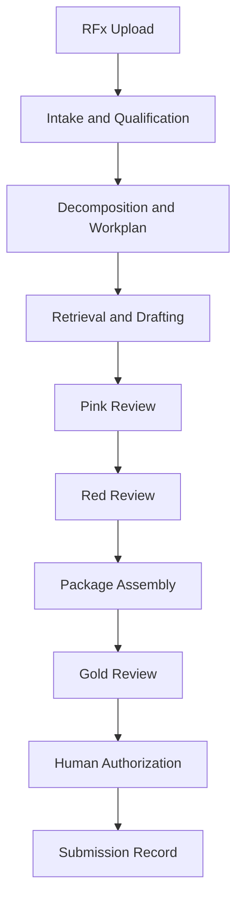
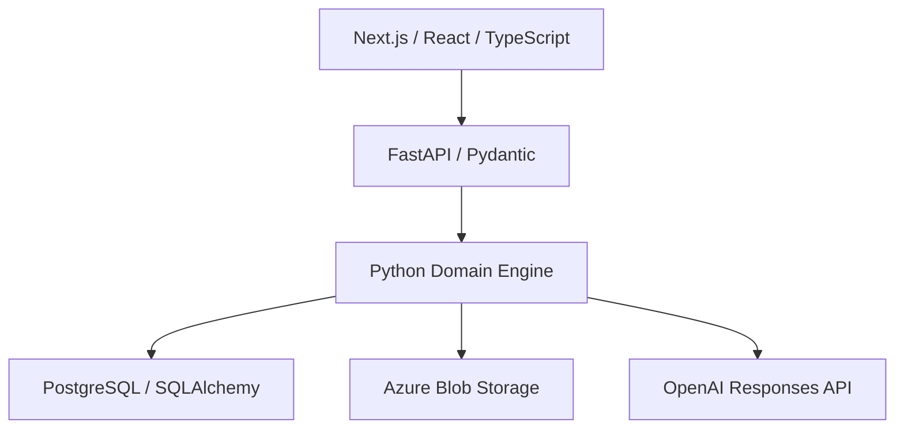

# RFP Engine

**An AI-assisted orchestration platform for managing complex RFx pursuits from intake and qualification through drafting, review, package assembly, and submission readiness.**

RFP Engine combines LLM-based agents with deterministic workflow controls, persistent opportunity state, source-grounded context, human approval gates, artifact lineage, and regression-tested proposal workflows.

> This public repository documents the product, architecture, governance model, and development progress. The active application source remains in a separate private development repository while the project is prepared for a safe public release.

## Latest development milestone — September 13, 2026

The live acceptance path now advances safely into an explicit information hold rather than failing or inventing missing evidence. The persisted opportunity moved through intake and structured analysis to `AWAITING_INFORMATION`, demonstrating that the controller can commit progress and stop at a governed human boundary.

Recent engineering work includes:

- successful persistence of the next authoritative opportunity revision after model-backed processing;
- explicit separation between a valid workflow hold and an application error;
- exposed routes for supplying human decisions or additional source material before execution resumes;
- validation of the local PostgreSQL-backed runtime and bundle test suite; and
- completion of a knowledge-approval workspace design and implementation package for governing reusable content before it enters retrieval and drafting.

The knowledge-governance workflow is designed to let authorized reviewers inspect provenance, edit candidate content, approve or reject it, and preserve the decision record. Current work is focused on wiring that interface into the application and continuing the end-to-end acceptance path through drafting and review.

See the [development log](docs/development-log.md) for dated milestones.

## The problem

Proposal teams do not merely need faster text generation. They need a system that can:

- distinguish solicitation evidence from assumptions;
- stop when required evidence or authority is missing;
- prevent unsupported contractual and technical commitments;
- preserve the exact state and artifacts that were reviewed;
- route discrete decisions to humans without halting unrelated work; and
- bind final approval to the exact package that is submitted.

RFP Engine treats generative AI as one component inside an auditable operational system.

## RFx lifecycle

## Technical architecture

| Layer | Technology | Responsibility |
|---|---|---|
| Web | Next.js, React, TypeScript | Upload, opportunity workspace, review and package controls |
| API | FastAPI, Pydantic | Typed application boundary and multipart intake |
| Domain engine | Python | Workflow execution, validation, gates, reviews, package control |
| Persistence | PostgreSQL, SQLAlchemy, Alembic | Atomic authoritative state and durable read models |
| Artifacts | Azure Blob Storage | Immutable source and generated-artifact storage |
| AI runtime | OpenAI Responses API | Schema-bound analysis and drafting |
| Development | Docker Compose, GitHub Actions | Reproducible services and continuous integration |

## What has been built

- Multi-file PDF, DOCX, XLSX, and TXT solicitation intake
- Normalized source blocks and versioned requirement inventories
- Atomic Opportunity Record revisions with SHA-256 verification
- Restart-safe artifact storage and explicit artifact lineage
- Deterministic controller execution and schema validation
- Structured, model-backed agent invocation
- Human hold-and-resume workflows
- Governed knowledge-approval workspace design for reusable content
- Component-scoped drafting status and evidence gaps
- Pink and Red review execution with correction loops
- Candidate Package Assembly and deterministic proposal rendering
- Gold review bound to an exact package version
- Explicit final submission authorization
- Immutable submission record and receipt lineage
- PostgreSQL-backed regression testing and CI

## Core design principles

### Human supervises. Engine executes.

The application reduces orchestration burden while preserving explicit human authority over commitments, missing evidence, commercial decisions, and submission.

### Fail closed

Missing evidence, invalid schemas, stale revisions, and package mismatches stop affected operations instead of being silently guessed or repaired.

### Separate probabilistic work from deterministic control

Models analyze and draft. Domain services own workflow transitions, persistence, validation, lineage, and authorization.

### Bind decisions to exact artifacts

Reviews and approvals apply to an identified artifact or package version and checksum. Material change invalidates downstream approval.

## Why the regression tests matter

The historical regression program tests whether the engine behaves safely under realistic proposal pressure—not merely whether it can produce fluent text.

Tested behaviors include:

- stopping when evidence is genuinely missing;
- allowing unaffected drafting components to continue;
- preventing unsupported security, SLA, and commercial commitments;
- persisting authoritative state across restarts;
- detecting incomplete package inputs;
- separating proposal authority from pricing authority;
- requiring re-review when a package changes; and
- preventing submission of anything other than the exact authorized package.

Read the [regression testing story](docs/regression-testing.md) for representative scenarios.

## Documentation

- [Architecture and control boundaries](docs/architecture.md)
- [Development log](docs/development-log.md)
- [Regression testing](docs/regression-testing.md)
- [Portfolio and competency map](docs/portfolio-guide.md)
- [Public data policy](PUBLIC_DATA_POLICY.md)
- [Roadmap](ROADMAP.md)

## Current status

The application has a working full-stack foundation and an implemented controlled lifecycle from upload through submission closeout. The live acceptance path now persists authoritative state through an explicit information hold, and the next application increment adds human approval controls for reusable knowledge. Current work is focused on integrating that governance interface and validating the remaining drafting-through-closeout pipeline.

## Author

Designed and built by [whitman-neek](https://github.com/whitman-neek) at the intersection of proposal operations, governed AI workflows, and software product design.
